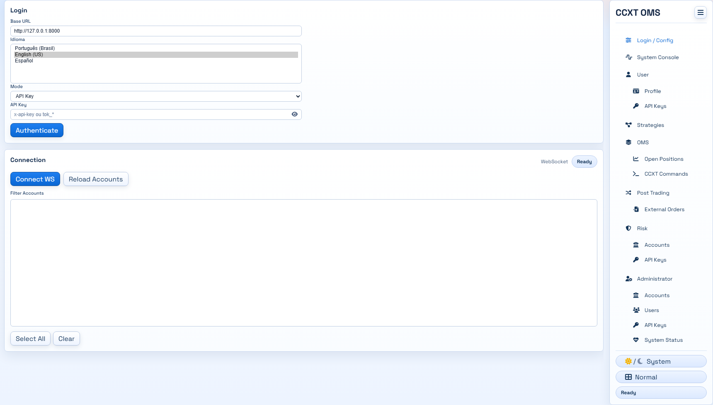
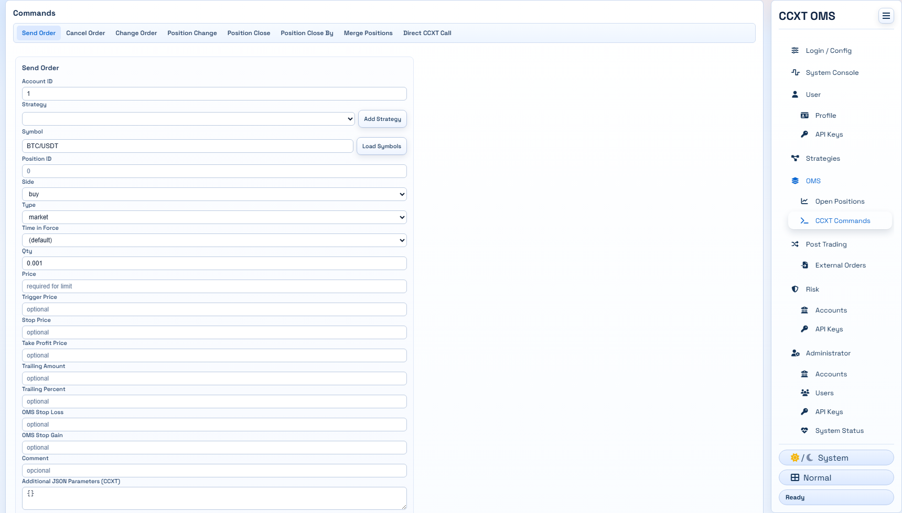
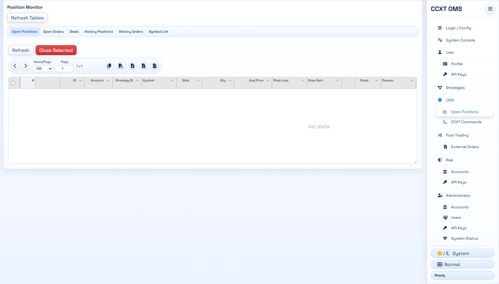
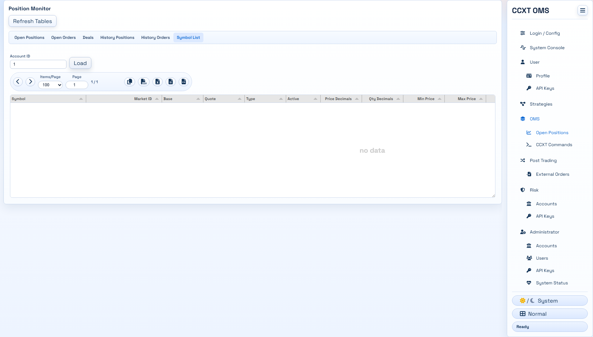
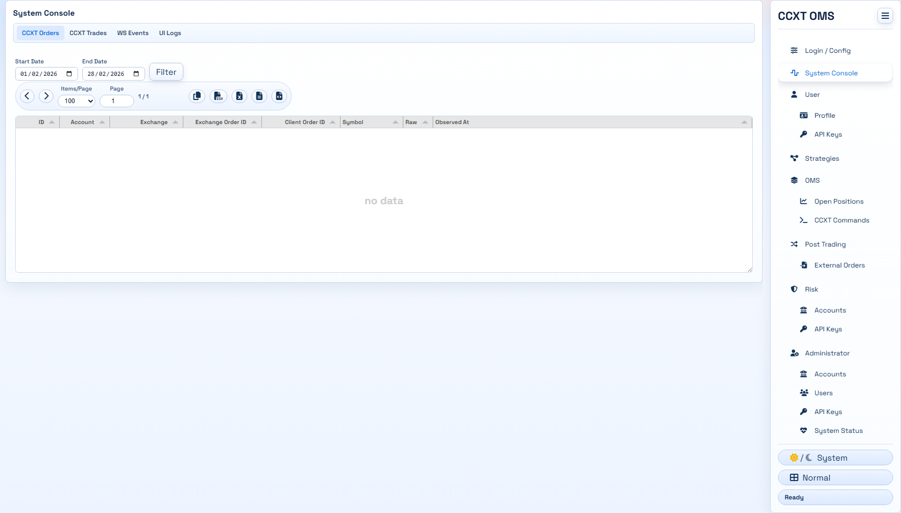
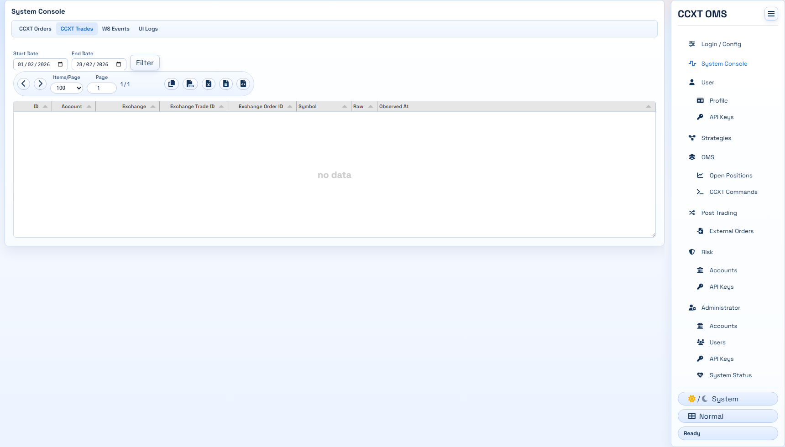
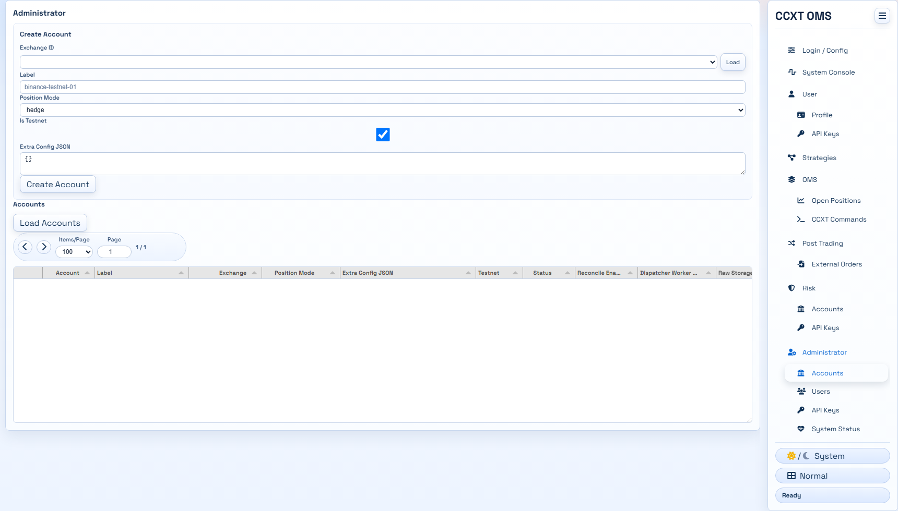
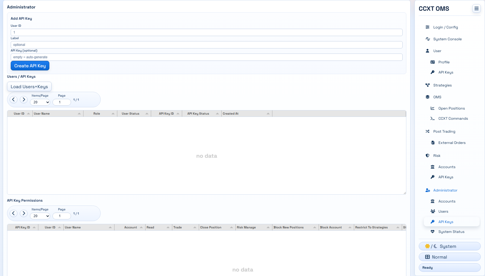
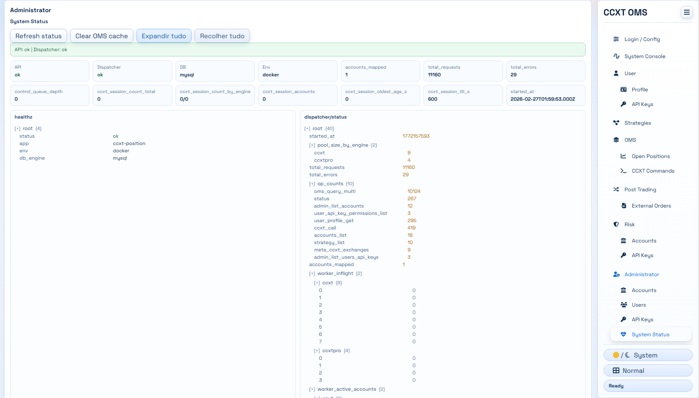
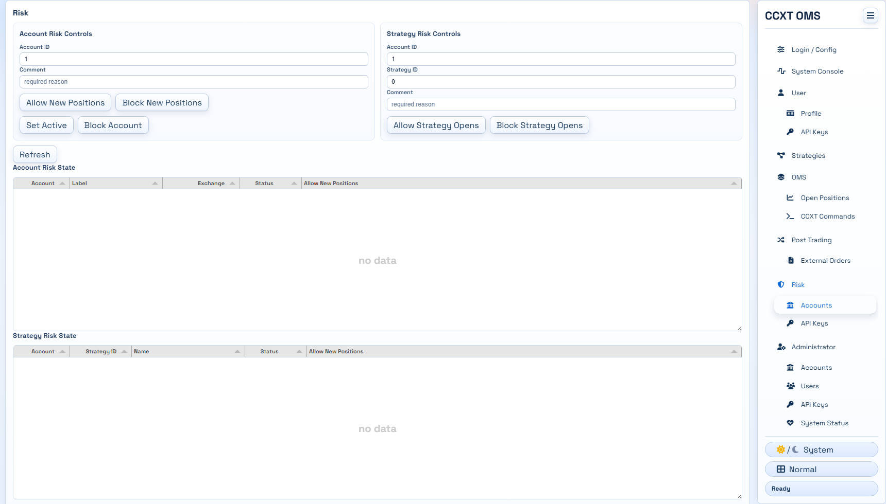

# ccxt-position

`ccxt-position` is a single-host OMS gateway that combines:

- A CCXT-like API surface (`/ccxt`) for direct exchange routing
- An MT5-like position engine (`/oms`) for orders, deals, positions, and reconciliation

## Project Status

Specification-first bootstrap with first implementation slice available in `apps/api`:

- FastAPI app startup/shutdown
- API key auth (`x-api-key`, SHA-256 lookup)
- `POST /oms/commands` with batch support
- Position query/reassign endpoints and CCXT gateway endpoints
- WebSocket (`/ws`) with command/call and outbox event streaming
- MySQL persistence for commands/orders/deals/positions, raw sync, and queue
- Worker processing pipeline with CCXT execution and raw exchange sync

## Core Concepts

- `account`: an exchange credential set and runtime config
- `order`: command intent and exchange lifecycle state
- `deal`: executed trade event
- `position`: MT5-like tracked exposure
- `strategy_id`: strategy/robot identifier (`0` = automatic/default)

## User Profiles

- `admin`: admin/backoffice only (can manage users/accounts/permissions; cannot place trades)
- `trader`: discretionary trader permissions
- `portfolio_manager`: portfolio/manager trading permissions
- `robot`: automated strategy/robot permissions
- `risk`: risk controls (close/block/unblock) with mandatory action comment
- `readonly`: read-only visibility

## API Surfaces

- `POST /oms/commands`: unified MT5-like command entrypoint
- `POST /ccxt/{account_id}/{func}`: CCXT function gateway
- `POST /ccxt/commands`: batch CCXT commands
- `WS /ws`: unified websocket envelope (`position_*` and `ccxt_*`)

## Front-end Gallery

Screenshots (generated from local UI):












Generate or refresh screenshots:

```bash
# install front-end deps
npm --prefix apps/front-end install

# one-time (python screenshot script)
py -3.13 -m pip install playwright
py -3.13 -m playwright install chromium

# run front-end (example)
npm --prefix apps/front-end run dev

# in another shell, generate screenshots
py -3.13 scripts/capture_front_screenshots.py \
  --front-url http://127.0.0.1:5173 \
  --api-url http://127.0.0.1:8000 \
  --api-key <YOUR_API_KEY>
```

## Documentation Index

- Architecture: `docs/architecture/overview.md`
- Runtime topology: `docs/architecture/runtime-topology.md`
- Data flow: `docs/architecture/data-flow.md`
- Domain mapping: `docs/domain/mt5-mapping.md`
- Position API: `docs/api/rest-position.md`
- CCXT API: `docs/api/rest-ccxt.md`
- WebSocket contract: `docs/api/websocket.md`
- Schema catalog: `docs/data/table-catalog.md`
- Security model: `docs/security/authentication.md`
- Operations: `docs/ops/deployment-single-host.md`
- Simple Front: `docs/ops/front-end.md`
- Roadmap: `docs/roadmap/mvp-scope.md`
- Testnet bootstrap: `test/testnet/README.md`
  - Includes `run.py` (bootstrap) and `scenarios.py` (hedge/netting + multi-strategy live validation)

## Beginner Install (Docker)

This is the fastest way to run everything from zero.

1. Copy Docker config:

```bash
cp apps/api/config.docker.example.json apps/api/config.docker.json
```

2. Start stack (`mysql + api + worker`):

```bash
docker compose -f apps/api/docker-compose.stack.yml up -d --build
```

Note:

- Docker image uses `aiomysql` by default to avoid native compilation issues.
- If you explicitly need `asyncmy`, use `apps/api/requirements-asyncmy.txt` outside Docker.

3. Run installer (creates schema, internal user, internal API key, and one account):

```bash
docker compose -f apps/api/docker-compose.stack.yml exec api \
  python -m apps.api.cli install --with-account --exchange-id ccxt.binance --label binance-testnet --testnet
```

If schema was already initialized by MySQL entrypoint, use:

```bash
docker compose -f apps/api/docker-compose.stack.yml exec api \
  python -m apps.api.cli install --skip-schema --with-account --exchange-id ccxt.binance --label binance-testnet --testnet
```

Save values returned by installer:

- `api_key.plain` (internal API key for `x-api-key`)
- `account.id` (account to bind Binance credentials)

4. Store Binance Testnet credentials on created account:

```bash
docker compose -f apps/api/docker-compose.stack.yml exec api \
  python -m apps.api.cli upsert-account-credentials \
  --account-id <ACCOUNT_ID> \
  --api-key "<BINANCE_TESTNET_API_KEY>" \
  --secret "<BINANCE_TESTNET_SECRET_KEY>" \
  --encrypt-input
```

5. Validate API is running:

```bash
curl http://127.0.0.1:8000/healthz
```

6. Validate CCXT connectivity (`fetch_balance`):

```bash
curl -X POST "http://127.0.0.1:8000/ccxt/core/<ACCOUNT_ID>/fetch_balance" \
  -H "x-api-key: <INTERNAL_API_KEY_PLAIN>" \
  -H "Content-Type: application/json" \
  -d "{\"params\":{}}"
```

7. Optional test order (limit):

```bash
curl -X POST "http://127.0.0.1:8000/ccxt/core/<ACCOUNT_ID>/create_order" \
  -H "x-api-key: <INTERNAL_API_KEY_PLAIN>" \
  -H "Content-Type: application/json" \
  -d "{\"symbol\":\"BTC/USDT\",\"side\":\"buy\",\"order_type\":\"limit\",\"amount\":\"0.001\",\"price\":\"10000\",\"params\":{}}"
```

